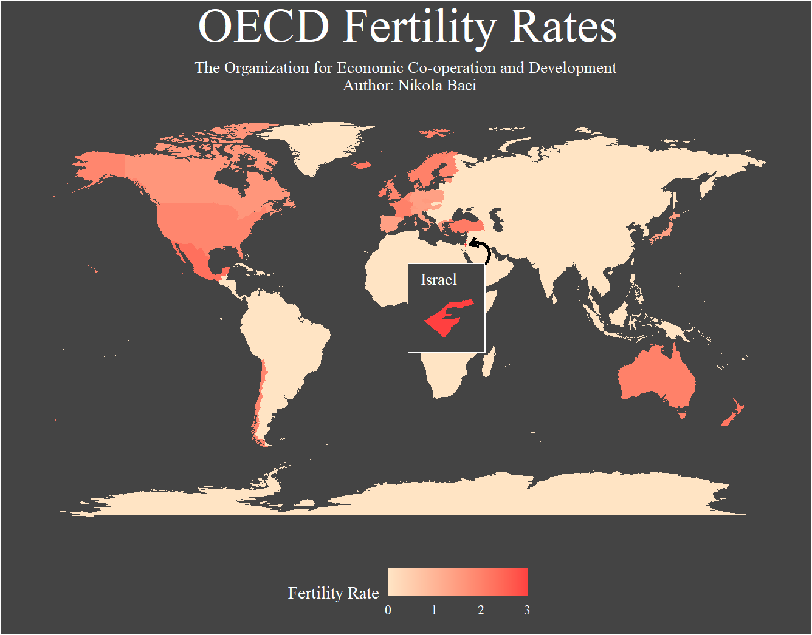

# OECD Countries Fertility Rate Map

The Organization for Economic Co-operation and Development is an international organization that strives to create policies that improve quality of life.

Mainly composed of developed countries, this organization fosters international co-operation and as such it has access to international data.

Using the 2010 Family Database that they have publish, I created a map of fertility rates of each member country.

What do I mean by fertility?
Fertility rate is the average number of children born to a woman over her lifetime.

Top fertile countries are:
-  Israel
- Mexico
- Iceland

Least fertile countries are:
- Spain
- Hungary
- Korea

